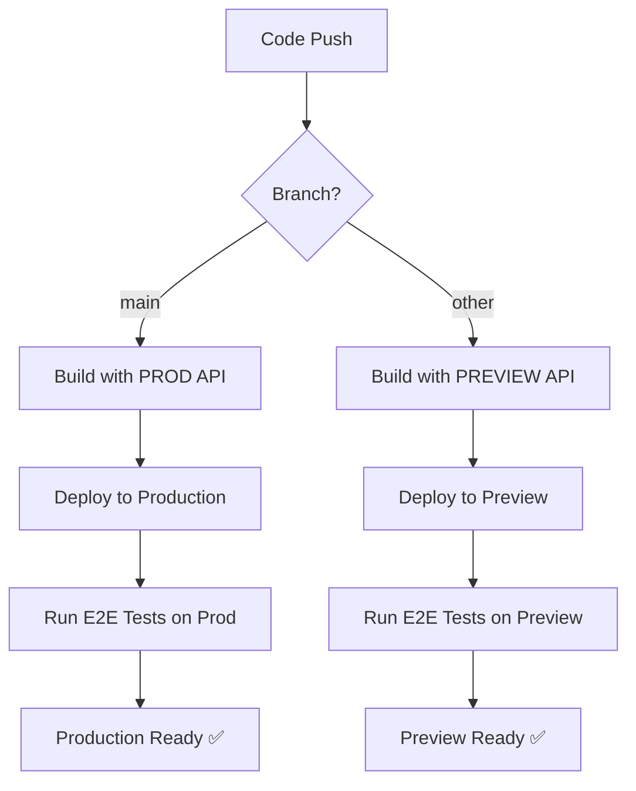

# Azure DevOps Pipeline Setup for Scout Analytics

## Overview

This guide sets up an Azure DevOps pipeline that automatically builds and deploys Scout Analytics with the correct API URLs for different environments.

## 🎯 Pipeline Features

### Automatic API URL Selection
- **Main branch** → Production API (`API_URL_PROD`)
- **All other branches/PRs** → Preview API (`API_URL_PREVIEW`)
- **Local development** → `http://localhost:5000` (fallback in `api.ts`)

### Environment-Specific Deployments
- **Preview Environment**: All PRs and feature branches
- **Production Environment**: Only main branch merges
- **E2E Testing**: Automated tests against deployed environments

## 📋 Setup Instructions

### 1. Create Variable Group in Azure DevOps

1. Go to **Pipelines → Library → + Variable group**
2. Create a group named **`Scout-API-URLs`**
3. Add these variables:

| Variable Name     | Value                                          | Secret |
|-------------------|------------------------------------------------|--------|
| `API_URL_PREVIEW` | `https://preview-api.scout-analytics.com`     | No     |
| `API_URL_PROD`    | `https://prod-api.scout-analytics.com`        | No     |
| `AZURE_SUBSCRIPTION` | `Scout-Analytics-Production`               | No     |
| `AZURE_CLIENT_ID` | Your Managed Identity Client ID               | Yes    |
| `AZURE_TENANT_ID` | Your Azure Tenant ID                          | Yes    |
| `KEY_VAULT_NAME`  | `kv-projectscout-prod`                         | No     |
| `AZURE_SQL_SERVER` | `scout-sql-server.database.windows.net`      | No     |
| `AZURE_SQL_DATABASE` | `scout_analytics`                           | No     |
| `AZURE_OPENAI_ENDPOINT` | `https://tbwa-openai.openai.azure.com` | No     |
| `AZURE_OPENAI_DEPLOYMENT` | `gpt-4`                                | No     |
| `AZURE_OPENAI_API_VERSION` | `2024-02-15-preview`                   | No     |

### 2. Create Service Connection

1. Go to **Project Settings → Service connections**
2. Create **Azure Resource Manager** connection
3. Name it **`Scout-Analytics-Production`**
4. Grant access to your Azure subscription
5. Authorize for all pipelines

### 3. Create Environments

1. Go to **Pipelines → Environments**
2. Create these environments:
   - **`scout-analytics-dashboard-preview`**
   - **`scout-analytics-dashboard-production`**
3. Configure approval gates for production (recommended)

### 4. Set Up Azure Resources

Run the setup scripts to create required Azure resources:

```bash
# Authenticate and set up Managed Identity
source ./scripts/auto-login.sh
./scripts/setup-managed-identity.sh

# Verify setup
node scripts/test-managed-identity.js
```

## 🔄 Pipeline Workflow

### Branch-Based Deployment Strategy



### Pipeline Stages

1. **🏗️ Build & Test**
   - Install dependencies with caching
   - Run ESLint and unit tests
   - Build with environment-specific API URL
   - Publish build artifacts

2. **🚀 Deploy Preview** (non-main branches)
   - Deploy to preview App Service
   - Use preview API URL
   - Available for testing PRs

3. **🚀 Deploy Production** (main branch only)
   - Verify Managed Identity setup
   - Deploy to production App Service
   - Use production API URL
   - Configure Azure authentication

4. **🧪 End-to-End Tests**
   - Run Playwright tests against deployed environment
   - Test both preview and production deployments
   - Publish test results

## 🌐 Environment Configuration

### API URL Injection

The pipeline automatically sets `VITE_API_URL` based on the branch:

```yaml
# For main branch
- name: VITE_API_URL
  value: $(API_URL_PROD)     # https://prod-api.scout-analytics.com

# For other branches  
- name: VITE_API_URL
  value: $(API_URL_PREVIEW)  # https://preview-api.scout-analytics.com
```

### Local Development Fallback

In `src/config/api.ts`:
```typescript
const API_BASE_URL = import.meta.env.VITE_API_URL || 'http://localhost:5000';
```

This ensures local development works without any environment setup.

## 🔐 Security Configuration

### Managed Identity in Production

The pipeline automatically configures:
- System-assigned Managed Identity for the App Service
- Key Vault access for secrets
- SQL Database authentication
- Azure OpenAI credentials

### Secrets Management

- **Production**: All secrets retrieved from Key Vault via Managed Identity
- **Preview**: Environment variables from Variable Group
- **Local**: Fallback to `.env.local` file

## 🧪 Testing Strategy

### Automated Testing Levels

1. **Unit Tests**: Run on every build
2. **Lint Checks**: Code quality verification
3. **E2E Tests**: Full application testing post-deployment
4. **Manual Testing**: Preview environment for stakeholder review

### Test Environment URLs

- **Production**: `https://scout-analytics-dashboard.azurewebsites.net`
- **Preview**: `https://scout-analytics-dashboard-preview.azurewebsites.net`
- **Local**: `http://localhost:5173`

## 📊 Monitoring and Observability

### Pipeline Monitoring

- Build status badges in README
- Test result publishing
- Deployment environment tracking
- Performance metrics collection

### Application Monitoring

- Azure Application Insights integration
- Custom telemetry for API calls
- Error tracking and alerting
- Performance monitoring

## 🚀 Usage Examples

### Triggering Builds

```bash
# Create a feature branch (builds with preview API)
git checkout -b feature/new-dashboard
git push origin feature/new-dashboard

# Merge to main (builds with production API)
git checkout main
git merge feature/new-dashboard
git push origin main
```

### Environment-Specific Testing

```bash
# Test against preview environment
curl https://scout-analytics-dashboard-preview.azurewebsites.net/api/health

# Test against production environment  
curl https://scout-analytics-dashboard.azurewebsites.net/api/health
```

## 🔧 Troubleshooting

### Common Issues

1. **Build fails with API URL error**
   - Check Variable Group configuration
   - Verify `Scout-API-URLs` group is linked to pipeline

2. **Deployment fails**
   - Verify Service Connection permissions
   - Check Azure resource names in variables

3. **Managed Identity issues**
   - Run `./scripts/setup-managed-identity.sh`
   - Verify App Service identity assignment

4. **E2E tests fail**
   - Check deployment URLs are accessible
   - Verify test configuration for environment

### Debug Commands

```bash
# Check pipeline variables
az pipelines variable-group show --group-id <group-id>

# Test App Service deployment
az webapp show --name scout-analytics-dashboard --resource-group scout-dashboard-rg

# Verify Managed Identity
az webapp identity show --name scout-analytics-dashboard --resource-group scout-dashboard-rg
```

## 📚 Additional Resources

- [Azure DevOps Pipeline Documentation](https://docs.microsoft.com/en-us/azure/devops/pipelines/)
- [Azure App Service Deployment](https://docs.microsoft.com/en-us/azure/app-service/)
- [Managed Identity Setup Guide](./AZURE_AUTH_SETUP_COMPLETE.md)
- [Azure OpenAI Integration](./AZURE_OPENAI_SETUP.md)

---

## ✅ Verification Checklist

- [ ] Variable Group `Scout-API-URLs` created with all required variables
- [ ] Service Connection `Scout-Analytics-Production` configured
- [ ] Environments `scout-analytics-dashboard-preview` and `scout-analytics-dashboard-production` created
- [ ] Azure resources created via `./scripts/setup-managed-identity.sh`
- [ ] Pipeline file `azure-pipelines.yml` committed to repository
- [ ] First build triggered and successful
- [ ] Preview deployment accessible
- [ ] Production deployment (main branch) successful
- [ ] E2E tests passing

**Result**: Complete CI/CD pipeline with automatic API URL switching and secure Azure authentication! 🎉